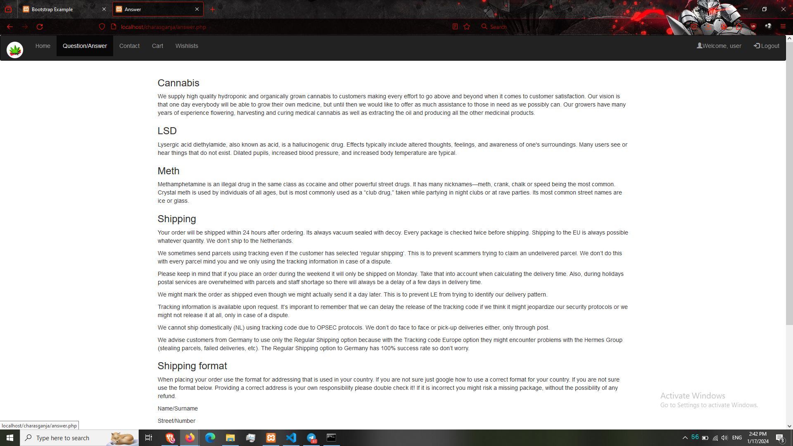

# Ecommerce
An Ecommerce platform for sales of product.

## Installation
First Download all the code. Copy to apache location. import .sql file to phpmyadmin.

## ScreenShot

> Register

> Login

> Index

> Category

> Product

> FAQ

> Contact

> Cart

> Wishlists

> Admin

> Schema

